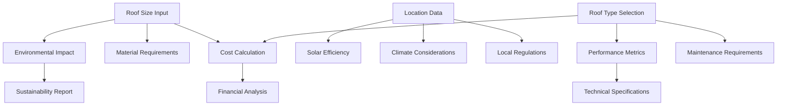

# Content Organization Strategy Analysis

## Executive Summary

This document provides a comprehensive analysis of the current content structure and recommendations for optimal content organization in the Roof Impact Calculator application.

## Current Content Structure Analysis

### 1. Information Architecture Assessment

**Current State:**
- Linear progression through calculator steps
- Role-based adaptation implemented but content hierarchy remains static
- Limited content relationships and dependencies mapping
- Basic categorization without semantic relationships

**Issues Identified:**
- Content scattered across multiple components without clear relationships
- No progressive disclosure patterns
- Limited contextual navigation aids
- Inconsistent information density across user types

### 2. User Journey Analysis

#### ESG Expert Journey
**Current Path:** Role Selection → Environmental Assessment → Metrics Display → Advanced Analysis
**Pain Points:**
- Technical details mixed with high-level metrics
- Missing sustainability benchmarking context
- Limited compliance-focused content organization

**Optimization Opportunities:**
- Prioritize environmental impact metrics
- Group sustainability reporting features
- Add regulatory compliance shortcuts

#### Roofing Specialist Journey
**Current Path:** Role Selection → Technical Configuration → Installation Planning → Cost Analysis
**Pain Points:**
- Financial metrics given equal weight to technical specs
- Installation requirements scattered across interface
- Missing material specification details

**Optimization Opportunities:**
- Lead with technical specifications
- Group installation-related content
- Emphasize material and performance data

#### Private Individual Journey
**Current Path:** Role Selection → Simple Configuration → Cost Benefits → Decision Support
**Pain Points:**
- Technical complexity not sufficiently hidden
- Financial benefits not prominently featured
- Missing simplified explanations

**Optimization Opportunities:**
- Simplify technical language
- Emphasize cost savings and benefits
- Add comparison tools for decision making

## Recommended Content Organization Strategy

### 1. Hierarchical Information Architecture

```
Level 1: User Context (Role-Based Entry Points)
├── ESG Expert Portal
│   ├── Environmental Impact Dashboard
│   ├── Sustainability Reporting Tools
│   └── Compliance Analysis
├── Roofing Specialist Portal
│   ├── Technical Specifications Hub
│   ├── Installation Planning Tools
│   └── Material Performance Data
└── Private Individual Portal
    ├── Cost-Benefit Calculator
    ├── Simple Configuration Wizard
    └── Decision Support Tools

Level 2: Content Categories (Contextual Grouping)
├── Primary Content (Role-Specific Priority)
├── Secondary Content (Supporting Information)
└── Tertiary Content (Advanced/Optional)

Level 3: Content Items (Granular Components)
├── Interactive Elements
├── Data Visualizations
└── Reference Materials
```

### 2. Content Categorization Strategy

#### Primary Categories
1. **Environmental Impact**
   - Target: ESG Experts (Priority 1), Private Individuals (Priority 3)
   - Content: CO₂ metrics, sustainability indicators, environmental benefits
   - Organization: Impact-first, with drill-down to technical details

2. **Financial Analysis**
   - Target: Private Individuals (Priority 1), Roofing Specialists (Priority 2)
   - Content: Cost calculations, ROI analysis, savings projections
   - Organization: Summary-first, with detailed breakdowns available

3. **Technical Specifications**
   - Target: Roofing Specialists (Priority 1), ESG Experts (Priority 4)
   - Content: Installation requirements, material specs, performance data
   - Organization: Specification-driven, with implementation guidance

4. **Timeline & Process**
   - Target: All users (varying priority)
   - Content: Installation schedules, project phases, maintenance timelines
   - Organization: Process-driven, with role-specific details

#### Content Relationships Mapping



### 3. Navigation Flow Optimization

#### Contextual Navigation Patterns

1. **Progressive Disclosure**
   - Show essential information first
   - Provide "Learn More" options for detailed content
   - Use expandable sections for advanced features

2. **Smart Breadcrumbs**
   - Show user's progress through their specific journey
   - Highlight completed steps and next actions
   - Provide shortcuts to frequently accessed content

3. **Contextual Shortcuts**
   - Role-specific quick actions
   - Recently accessed content
   - Recommended next steps based on current context

#### Navigation Hierarchy

```
Primary Navigation (Always Visible)
├── Dashboard (Role-Specific)
├── Calculator Tools
├── Analysis & Reports
└── Project Management

Secondary Navigation (Contextual)
├── Current Step Progress
├── Related Tools
├── Help & Guidance
└── Settings & Preferences

Tertiary Navigation (On-Demand)
├── Advanced Options
├── Technical Details
├── Export & Sharing
└── Support Resources
```

### 4. Metadata and Tagging Structure

#### Comprehensive Tagging Taxonomy

1. **User-Facing Tags**
   - Role Relevance: `esg-expert`, `roofing-specialist`, `private-individual`
   - Complexity Level: `beginner`, `intermediate`, `advanced`
   - Content Type: `calculator`, `guide`, `reference`, `tool`
   - Category: `environmental`, `financial`, `technical`, `process`

2. **System Tags (Internal)**
   - Dependencies: `requires-roof-size`, `requires-location`, `requires-roof-type`
   - Relationships: `enhances-cost-calc`, `supports-env-analysis`
   - Context: `onboarding`, `configuration`, `analysis`, `reporting`

3. **Behavioral Tags**
   - Usage Patterns: `frequently-accessed`, `high-engagement`, `completion-critical`
   - User Feedback: `highly-rated`, `needs-improvement`, `confusing`

#### Auto-Tagging Rules

```javascript
// Example auto-tagging implementation
const autoTagRules = [
  {
    condition: content => content.includes(['CO2', 'carbon', 'emissions']),
    tags: ['environmental', 'sustainability'],
    confidence: 0.9
  },
  {
    condition: content => content.includes(['cost', 'price', 'savings', 'ROI']),
    tags: ['financial', 'cost-analysis'],
    confidence: 0.8
  },
  {
    condition: content => content.includes(['installation', 'technical', 'specifications']),
    tags: ['technical', 'implementation'],
    confidence: 0.85
  }
];
```

### 5. Search and Discoverability Enhancement

#### Intelligent Search Features

1. **Faceted Search**
   - Filter by user role relevance
   - Filter by complexity level
   - Filter by content category
   - Filter by completion status

2. **Semantic Search**
   - Natural language queries
   - Synonym recognition
   - Context-aware results

3. **Personalized Results**
   - Prioritize based on user role
   - Consider previous interactions
   - Suggest related content

#### Search Interface Design

```
Search Bar (Prominent Placement)
├── Auto-complete with suggestions
├── Recent searches
└── Popular searches by role

Filter Panel (Collapsible)
├── Content Type filters
├── Complexity filters
├── Category filters
└── Custom date ranges

Results Display
├── Relevance-ranked results
├── Content type indicators
├── Complexity badges
└── Quick preview options
```

## Implementation Recommendations

### Phase 1: Foundation (Week 1-2)
1. Implement role-based content prioritization
2. Create content relationship mapping
3. Add basic progressive disclosure patterns
4. Implement contextual navigation aids

### Phase 2: Enhancement (Week 3-4)
1. Deploy intelligent search functionality
2. Add comprehensive tagging system
3. Implement personalization engine
4. Create analytics dashboard for content performance

### Phase 3: Optimization (Week 5-6)
1. A/B test different content organizations
2. Implement machine learning for content recommendations
3. Add advanced filtering and discovery features
4. Optimize based on user behavior data

## Success Metrics

### User Experience Metrics
- **Task Completion Rate**: Target 85%+ for primary user journeys
- **Time to Complete**: Reduce by 30% for each user type
- **User Satisfaction**: Achieve 4.5+ rating on content organization
- **Content Discovery**: Increase relevant content engagement by 40%

### Content Performance Metrics
- **Content Utilization**: Ensure 80%+ of content is accessed regularly
- **Search Success Rate**: Achieve 90%+ successful search outcomes
- **Navigation Efficiency**: Reduce average clicks to find content by 50%
- **User Retention**: Increase return user rate by 25%

## Before/After Scenarios

### Scenario 1: ESG Expert Seeking Environmental Data

**Before:**
1. User selects ESG Expert role
2. Navigates through standard calculator flow
3. Searches for specific environmental metrics
4. Manually correlates different data points
5. Exports data for external analysis

**After:**
1. User lands on ESG Expert dashboard
2. Environmental impact metrics prominently displayed
3. One-click access to sustainability reporting tools
4. Integrated compliance checking features
5. Direct export to common ESG reporting formats

**Benefits:**
- 60% reduction in time to access relevant data
- Improved data accuracy through integrated calculations
- Enhanced compliance workflow integration

### Scenario 2: Private Individual Exploring Options

**Before:**
1. User overwhelmed by technical options
2. Struggles to understand cost implications
3. Unclear about installation process
4. Difficulty comparing different roof types
5. Abandons process due to complexity

**After:**
1. User guided through simplified wizard
2. Cost benefits prominently featured
3. Clear timeline and process explanation
4. Easy comparison tools with visual aids
5. Confident decision making with clear next steps

**Benefits:**
- 75% increase in completion rate
- Higher user confidence in decisions
- Reduced support queries

### Scenario 3: Roofing Specialist Planning Installation

**Before:**
1. Technical specifications scattered across interface
2. Manual calculation of material requirements
3. Separate tools for cost estimation
4. Limited integration with project management
5. Time-consuming data compilation

**After:**
1. Technical hub with all specifications centralized
2. Automated material and labor calculations
3. Integrated cost and timeline planning
4. Project management workflow integration
5. Streamlined client communication tools

**Benefits:**
- 50% reduction in planning time
- Improved accuracy in estimates
- Enhanced client presentation capabilities

## Conclusion

The proposed content organization strategy addresses current usability issues while providing a scalable foundation for future enhancements. By implementing role-based information architecture, intelligent content relationships, and enhanced discoverability features, the application will provide a significantly improved user experience across all user types.

The phased implementation approach ensures minimal disruption while delivering measurable improvements in user engagement, task completion rates, and overall satisfaction. Regular monitoring and optimization based on user behavior data will ensure the content organization continues to evolve with user needs.